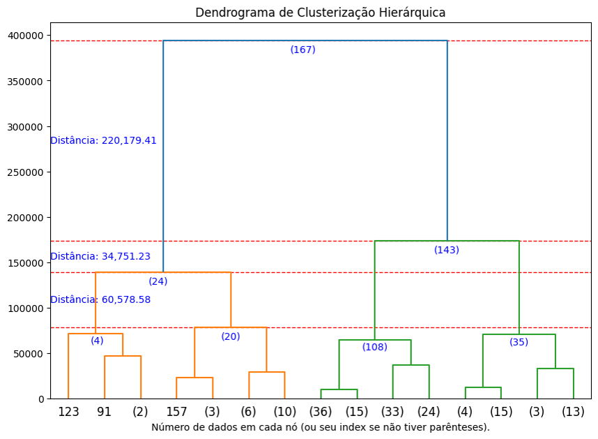

# Projeto de Disciplina de Algoritmos de Inteligência Artificial para Clusterização

Este projeto foi desenvolvido como parte da disciplina de Algoritmos de Inteligência Artificial para Clusterização, com o objetivo de aplicar técnicas de aprendizado não supervisionado para análise e agrupamento de dados. Foram utilizados diferentes modelos de clusterização para segmentar os dados e validar os agrupamentos formados, permitindo extrair insights valiosos sobre os padrões encontrados.
 
 
Durante o desenvolvimento, aprofundei meus conhecimentos sobre a implementação de diferentes algoritmos de clusterização, seus desafios, vantagens e as métricas utilizadas para validar os resultados obtidos.

## Índice

- <a href='#contexto'>1. Contexto</a>
- <a href='#tecnologias'>2. Tecnologias</a>
- <a href='#análise-exploratória'>3. Análise exploratória</a>
- <a href='#modelagem'>4. Modelagem</a>
    - <a href='#k-means-k-means-clustering'>4.1. K-Means</a>
    - <a href='#k-medoid-k-medoid-clustering'>4.1. K-Medoid</a>
    - <a href='#clusterização-hierárquica-hcluster---hierarchical-clustering'>4.1. Clusterização Hierárquica</a>
    - <a href='#dbscan-density-based-spatial-clustering-of-applications-with-noise'>4.2. DBSCAN</a>
- <a href='#métricas-de-validação'>5. Métricas de validação</a>
    - <a href='#índice-de-silhueta'>5.1. Índice de Silhueta</a>
    - <a href='#inércia'>5.2. Inércia</a>
    - <a href='#coeficiente-de-dunn'>5.3. Coeficiente de Dunn</a>
- <a href='#comparação-de-modelos'>6. Comparação entre os modelos
- <a href='#conclusões-gerais'>7. Conclusões gerais</a>
- <a href='#sobre-mim'>8. Sobre mim</a>

## Contexto

⬆️ <a href='#índice'>Voltar ao início</a>

O objetivo deste projeto foi explorar algoritmos de clusterização para analisar um conjunto de dados contendo informações econômicas e políticas sobre diversos países, disponível no arquivo '🌎 <a href='./data/country-data.csv'>country-data.csv</a>'.

A clusterização é uma técnica fundamental de aprendizado não supervisionado, pois permite identificar padrões ocultos e agrupar dados semelhantes sem a necessidade de rótulos prévios. Durante o desenvolvimento do projeto, foram testadas diferentes abordagens de agrupamento para avaliar sua eficiência e aplicabilidade ao conjunto de dados.

O conjunto de dados analisado contém as seguintes colunas principais:

O dataset contém variáveis que refletem indicadores econômicos e sociais de diferentes países. Abaixo, uma explicação detalhada de cada coluna:

- **Country** (País): Nome do país correspondente à linha do dataset.
- **GDP** (Produto Interno Bruto per capita): Representa a média do valor de todos os bens e serviços finais produzidos em um país, dividido pelo número de habitantes. Um PIB alto pode indicar um nível elevado de desenvolvimento econômico.
- **Child mortality** (Mortalidade infantil): Mede a quantidade de mortes de crianças com menos de 5 anos para cada 1.000 nascidos vivos. Uma taxa elevada pode indicar problemas estruturais em saúde pública.
- **Exports** (% do PIB) (Exportações): Percentual do PIB gerado por exportações de bens e serviços. Países altamente industrializados tendem a ter exportações elevadas.
- **Imports** (% do PIB) (Importações): Percentual do PIB destinado a importações de bens e serviços. Esse valor pode refletir a dependência do país em relação a mercados internacionais.
- **Net FDI** (% do PIB) (Investimento Direto Estrangeiro Líquido): Mede o fluxo de investimento estrangeiro no país como porcentagem do PIB. Valores positivos indicam um país atraente para investidores.
- **Health** (% do PIB) (Gastos com Saúde): Percentual do PIB destinado a investimentos em saúde pública e privada. Uma alta porcentagem pode indicar maior acessibilidade a serviços médicos.
- **Income** (Renda Média per capita): Reflete o nível médio de renda da população, afetando diretamente o padrão de vida.
- **Inflation** (Inflação): Representa a variação média dos preços ao consumidor ao longo do tempo. Uma inflação alta pode reduzir o poder de compra da população.
- **Life expectancy** (Expectativa de vida): Média de anos que uma pessoa nascida em determinado país pode esperar viver. É um indicador importante de qualidade de vida e desenvolvimento humano.

Em seguida, foram implementados e comparados quatro algoritmos de clusterização:

- <a href='#k-means-k-means-clustering'>K-Means</a>: que agrupa os dados com base em centroides ajustados iterativamente;

- <a href='#k-medoid-k-medoid-clustering'>K-Medoid</a>: similar ao K-Means, mas garantindo que os centros dos clusters sejam pontos reais do conjunto de dados;

- <a href='#clusterização-hierárquica-hcluster---hierarchical-clustering'>Clusterização Hierárquica (HCluster)</a>: que estrutura os agrupamentos em níveis hierárquicos sem necessidade de um número inicial de clusters;

- <a href='#dbscan-density-based-spatial-clustering-of-applications-with-noise'>DBSCAN</a>: que identifica grupos densos de dados e separa outliers de forma automática.

Cada modelo foi avaliado e comparado por meio de gráficos de dispersão e dendrogramas, permitindo compreender suas diferenças e aplicações.

## Tecnologias

 Anaconda v. 23.7.4 (ambiente virtual chamado '⚙️ venv_clusterizacao2')

 Jupyter Notebook v. 5.7.2

 Python v. 3.10.5

Principais bibliotecas:

-  Numpy v. 1.26.4 (para fins de compatibilidade)

-  Pandas

-  Scikit-learn

-  Seaborn

## Análise Exploratória

⬆️ <a href='#índice'>Voltar ao início</a>

Antes de aplicar os modelos de clusterização, realizamos uma análise exploratória dos dados para entender sua distribuição e identificar possíveis outliers. Utilizamos boxplots para visualizar a dispersão das variáveis numéricas, permitindo observar padrões e a variação entre os países analisados.

  

## Modelagem

⬆️ <a href='#índice'>Voltar ao início</a>

### K-Means (K-Means Clustering)

O K-Means foi o primeiro modelo testado, sendo amplamente utilizado devido à sua eficiência na criação de clusters bem definidos. O algoritmo inicia distribuindo aleatoriamente K centroides no espaço de dados e, a cada iteração, ajusta sua posição com base nos elementos atribuídos a cada grupo. Para encontrar o número ideal de clusters, utilizamos a técnica do "cotovelo", que avalia a variação da inércia à medida que K aumenta. No entanto, observamos que o método é sensível à escolha inicial dos centroides, podendo levar a agrupamentos inconsistentes caso os pontos iniciais não estejam bem distribuídos.

Outro desafio encontrado foi a presença de outliers, que influenciam significativamente a formação dos clusters. Como o K-Means minimiza a soma das distâncias quadradas dos pontos aos seus centroides, elementos muito distantes acabam deslocando os grupos, o que pode gerar agrupamentos distorcidos. Uma possível solução seria utilizar uma abordagem mais robusta, como o K-Medoid, que substitui os centroides por pontos reais do conjunto de dados.

### K-Medoid (K-Medoid Clustering)

⬆️ <a href='#índice'>Voltar ao início</a>

O K-Medoid funciona de maneira semelhante ao K-Means, mas se diferencia por sempre escolher pontos reais como medoides, evitando que valores extremos distorçam os agrupamentos. Essa característica torna o algoritmo mais robusto a outliers, já que os pontos centrais de cada cluster não podem ser influenciados por valores extremos. 

Durante os testes, percebemos que a distribuição dos dados afeta diretamente a estabilidade do modelo, sendo necessário um ajuste cuidadoso do número de clusters para obter bons resultados.

Entretanto, um dos desafios do K-Medoid é seu maior custo computacional. Como o algoritmo precisa calcular a distância de cada ponto para todos os demais em busca do medoide ideal, ele se torna mais lento em grandes conjuntos de dados. Apesar disso, a melhor estabilidade na definição dos clusters pode compensar essa limitação, tornando-o uma alternativa viável quando há presença de ruído nos dados.

### Clusterização Hierárquica (HCluster - Hierarchical Clustering)

⬆️ <a href='#índice'>Voltar ao início</a>

A Clusterização Hierárquica não requer a definição prévia do número de clusters, o que a torna útil para explorar a estrutura dos dados antes de decidir a melhor configuração de agrupamento. Utilizamos um dendrograma para visualizar as relações entre os elementos, o que facilitou a compreensão de como os países poderiam ser agrupados de forma natural. Diferentes critérios de ligação foram testados, como single linkage, complete linkage e average linkage, sendo que cada um influenciou a forma como os clusters foram formados.

Um dos principais desafios dessa abordagem foi sua complexidade computacional, já que o algoritmo requer um número elevado de comparações para formar a hierarquia de agrupamentos. Além disso, dependendo da métrica de distância utilizada, os resultados podem variar significativamente. No entanto, a clusterização hierárquica se mostrou uma ferramenta valiosa para explorar os padrões do conjunto de dados antes de aplicar métodos mais específicos.

  

### DBSCAN (Density-Based Spatial Clustering of Applications with Noise)

⬆️ <a href='#índice'>Voltar ao início</a>

O DBSCAN se destacou por sua capacidade de detectar clusters de diferentes formas e tamanhos, ao contrário dos métodos baseados em centroides. Esse algoritmo agrupa pontos densamente conectados e identifica aqueles que estão isolados como outliers. Durante os testes, ajustamos os hiperparâmetros Eps (raio de busca) e MinPts (quantidade mínima de pontos para formar um cluster), percebendo que pequenas variações nesses valores resultam em mudanças significativas nos agrupamentos.

Apesar da flexibilidade, o DBSCAN teve dificuldades quando os dados apresentaram variações de densidade muito grandes. Enquanto algumas áreas do espaço de dados eram corretamente agrupadas, outras ficavam mal definidas devido à falta de um critério uniforme para diferentes regiões. No entanto, o algoritmo foi eficaz na identificação de anomalias, o que pode ser útil para análises mais detalhadas de padrões irregulares.

  

## Métricas de Validação

⬆️ <a href='#índice'>Voltar ao início</a>

A validação de modelos de clusterização é essencial para garantir que os agrupamentos obtidos realmente refletem padrões nos dados. No projeto, utilizei diferentes métricas para avaliar a qualidade dos clusters formados.

### Índice de Silhueta

O Índice de Silhueta mede o quão bem os pontos estão agrupados dentro de um cluster e quão distintos eles são em relação a outros clusters. Ele varia de -1 a 1, onde valores próximos de 1 indicam que os clusters estão bem separados, e valores negativos indicam que os pontos podem estar mal agrupados.

Apliquei essa métrica para comparar a separação dos clusters nos diferentes modelos utilizados. No K-Means, valores altos do Índice de Silhueta indicaram que os grupos estavam bem formados, enquanto no DBSCAN, a métrica ajudou a avaliar a eficácia do modelo na detecção de agrupamentos densos.

### Inércia

A Inércia mede a soma das distâncias quadradas dos pontos ao centro do seu cluster. Quanto menor a inércia, mais compactos e bem definidos estão os clusters.

Utilizei essa métrica para ajustar o número de clusters no K-Means e no K-Medoid, por meio do método do cotovelo. A partir de um certo número de clusters, a redução da inércia se estabiliza, indicando o ponto ideal de agrupamento.

### Coeficiente de Dunn

O Coeficiente de Dunn avalia a compactação e separação dos clusters. Ele é calculado como a razão entre a menor distância entre clusters diferentes e o maior diâmetro dentro de um cluster. Quanto maior o coeficiente, melhor a separação entre os grupos.

Essa métrica ajudou a identificar se os clusters estavam muito dispersos ou bem concentrados. No DBSCAN, por exemplo, o coeficiente de Dunn ajudou a validar se o modelo estava segmentando corretamente os países com características semelhantes, diferenciando-os de outliers.

## Comparação de Modelos

⬆️ <a href='#índice'>Voltar ao início</a>

Os modelos de clusterização apresentaram diferenças significativas em termos de eficiência, aplicabilidade e sensibilidade aos dados.

O K-Means e o K-Medoid se mostraram eficazes para encontrar padrões bem definidos e compactos, especialmente quando os dados estavam bem distribuídos. No entanto, ambos foram sensíveis a outliers, pois elementos muito distantes dos centroides impactaram a formação dos grupos. O K-Medoid, por escolher pontos reais como centros, mostrou maior robustez a esses valores extremos, embora tenha um custo computacional mais alto.

A Clusterização Hierárquica permitiu visualizar a relação entre os países antes da definição dos grupos, auxiliando na escolha do número ideal de clusters. Sua abordagem baseada em dendrogramas foi útil para entender a estrutura dos dados, mas apresentou limitações em termos de escalabilidade para conjuntos de dados maiores.

O DBSCAN se destacou na detecção de padrões anômalos e na segmentação de países com diferentes densidades socioeconômicas. Como o modelo não exige a definição prévia do número de clusters, ele foi flexível na identificação de agrupamentos naturais. No entanto, a sensibilidade aos parâmetros Eps e MinPts exigiu diversos testes para encontrar valores adequados.

## Conclusões Gerais

⬆️ <a href='#índice'>Voltar ao início</a>

Os clusters formados pelos modelos refletem diferentes níveis de desenvolvimento socioeconômico dos países analisados. Com base nos agrupamentos obtidos, algumas conclusões importantes foram identificadas:

- **Cluster 0** (Países vulneráveis): Engloba nações com baixa expectativa de vida e baixa renda per capita, enfrentando dificuldades em saúde, educação e infraestrutura. Esses países possuem alta mortalidade infantil, inflação elevada e pouca capacidade de investimento, demandando políticas públicas mais eficazes para melhorar suas condições socioeconômicas.

- **Cluster 1** (Países em desenvolvimento): Reúne países com expectativa de vida média, mas ainda com baixa renda per capita. São economias em crescimento, com melhores condições de saúde e estabilidade econômica em relação ao Cluster 0, mas que ainda enfrentam desafios estruturais antes de alcançar um nível elevado de desenvolvimento.

- **Cluster 2** (Países desenvolvidos): Inclui nações com alta expectativa de vida e alta renda per capita, refletindo economias bem estruturadas, com inflação controlada, baixo índice de mortalidade infantil e acesso a serviços de qualidade. Esses países investem fortemente em tecnologia e inovação, garantindo maior estabilidade econômica e melhores condições de vida.

A análise dos clusters demonstrou que a segmentação socioeconômica pode ser utilizada para auxiliar políticas públicas, investimentos internacionais e planejamento econômico, permitindo uma melhor compreensão das desigualdades globais e identificação de oportunidades de crescimento para economias emergentes.

## Sobre mim

⬆️ <a href='#índice'>Voltar ao início</a>

    
    

        

            
            Mateus Teixeira
        

        Cientista de dados
         
        Pós-graduando em Inteligência Artifcial pela INFNET
         
         
        
        
        
    

