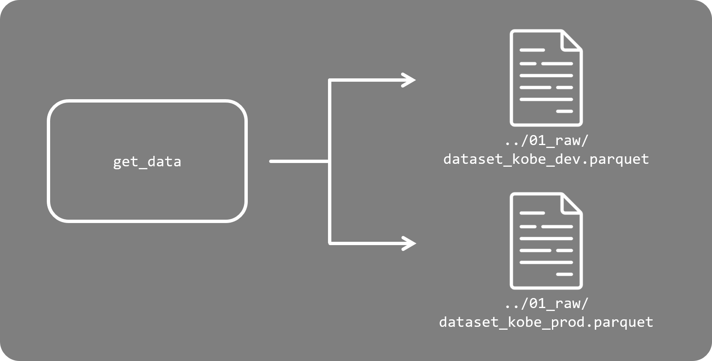
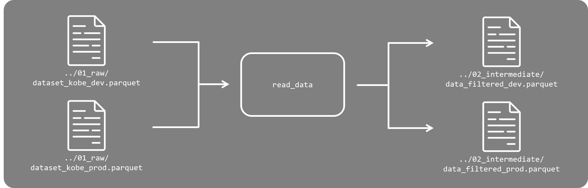
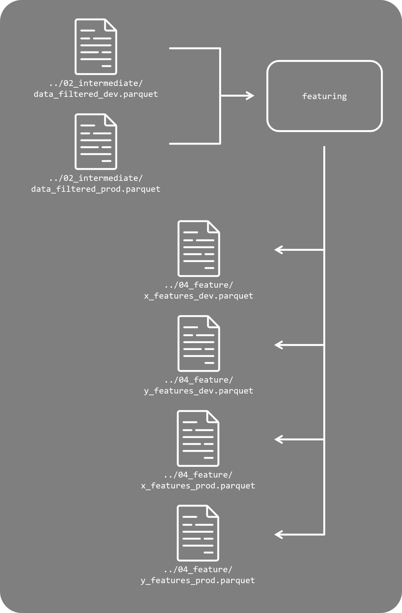
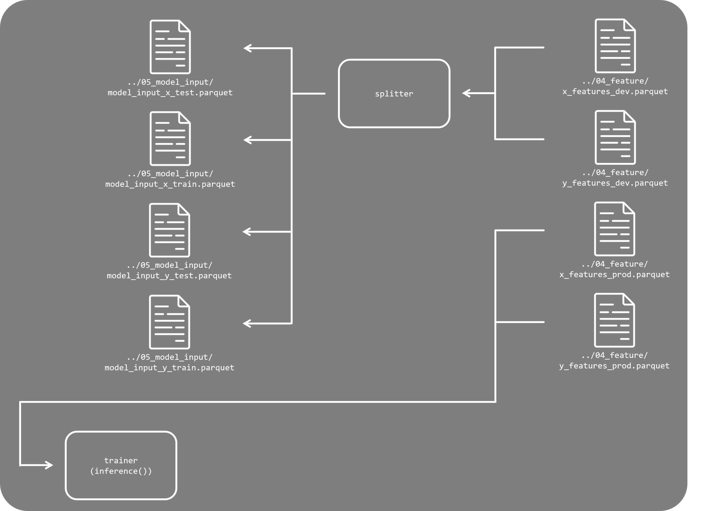
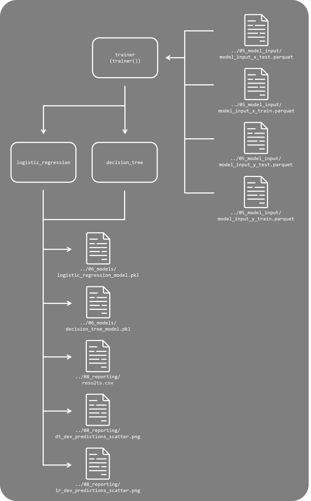
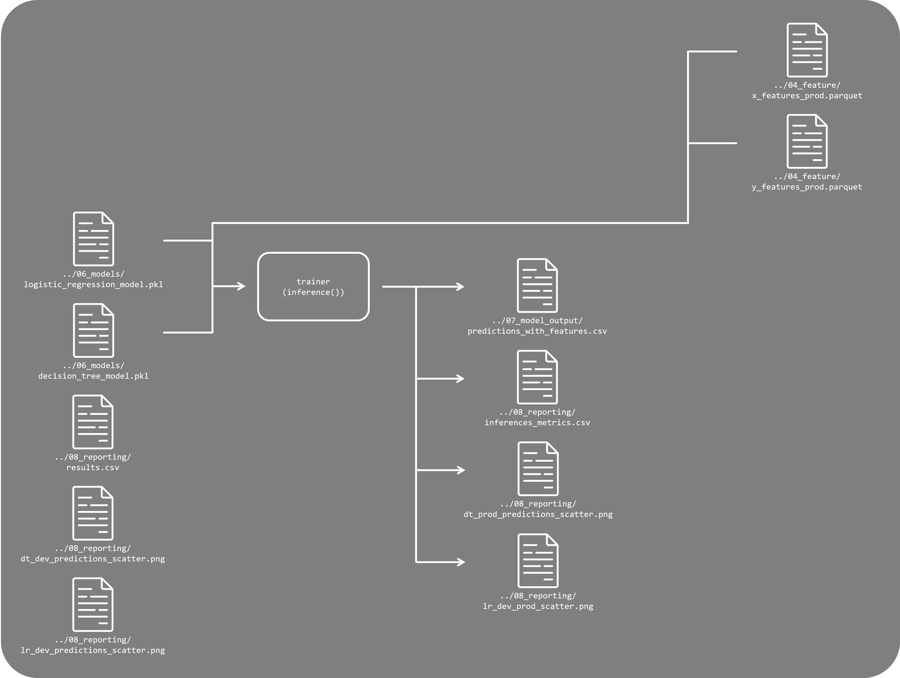
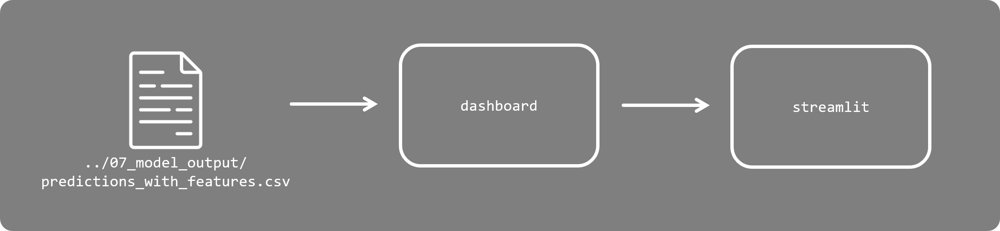

# Projeto de Disciplina de Engenharia de Machine Learning

 
Projeto desenvolvido na disciplina de Engenharia de Machine Learning para criar pipelines que preveem acertos de arremessos de basquete do Kobe Bryant, integrando melhores práticas de treinamento, avaliação e monitoramento de modelos.
 
 
 

## Índice

- <a href='#contexto'>1. Contexto</a>
- <a href='#tecnologias'>2. Tecnologias</a>
- <a href='#configuração-inicial'>3. Configuração inicial</a>
- <a href='#estrutura-do-projeto'>4. Estrutura do projeto
- <a href='#fluxograma-e-pipeline'>5. Fluxograma e pipeline
    - <a href='#parte-01-pegar-os-dados'>5.1. Pegar os dados
    - <a href='#parte-02-ler-e-tratar-dos-dados'>5.2. Ler e tratar dos dados
    - <a href='#parte-03-separar-as-features'>5.3. Separar as features
    - <a href='#parte-04-dividir-os-dados-de-produção-em-treino-e-teste'>5.4. Dividir os dados de produção em treino e teste
    - <a href='#parte-05-treinar-os-modelos-de-regressão-logística-logistic-regression-e-de-árvore-de-decisão'>5.5. Treinar os modelos de Regressão Logística (Logistic Regression) e de Árvore de Decisão
    - <a href='#parte-06-realizar-a-inferência-com-os-dados-de-produção'>5.6. Realizar a inferência com os dados de produção
    - <a href='#parte-07-produzir-o-dashboard-e-publicar-no-streamlit'>5.7. Produzir o dashboard e publicar no Streamlit
- <a href='#mlflow'>6. MlFlow
- <a href='#streamlit'>7. Streamlit
- <a href='#conclusões-gerais'>8. Conclusões gerais</a>
- <a href='#sobre-mim'>9. Sobre mim</a> 

## Contexto

Este projeto foi desenvolvido no contexto da disciplina de Engenharia de Machine Learning e visa aplicar conceitos avançados de aprendizado de máquina em um problema real: a previsão de acertos de arremessos do Kobe Bryant 🏀, um dos maiores jogadores da história do basquete. A partir de dados históricos detalhados sobre as características dos jogos, como posição na quadra, tempo restante e contexto (playoffs ou temporada regular), buscamos modelar as chances de sucesso dos arremessos do atleta.

Para alcançar esse objetivo, diversas etapas do ciclo de vida de aprendizado de máquina foram seguidas, como coleta e pré-processamento de dados, criação de pipelines de treinamento e monitoramento de modelos. Ferramentas como MLflow, Streamlit, PyCaret e Scikit-Learn foram empregadas para garantir eficiência, rastreabilidade e interatividade, permitindo a construção de soluções robustas e escaláveis. Além disso, o projeto contempla estratégias para monitorar a saúde do modelo e reavaliá-lo periodicamente, garantindo que ele se mantenha relevante mesmo em ambientes dinâmicos.

Este trabalho representa uma aplicação prática e detalhada das melhores práticas de engenharia de machine learning, integrando técnicas de modelagem, análise e visualização interativa. O resultado é um pipeline bem estruturado e documentado, que exemplifica como soluções de aprendizado de máquina podem ser desenvolvidas e mantidas com qualidade e precisão.

## Tecnologias

 Anaconda v. 23.7.4

 Jupyter Notebook v. 5.7.2

 Python v. 3.11.11

Principais bibliotecas:

-  Kedro 0.19.12

-  Matplotlib 3.7.5

-  MlFlow 2.12.2

-  Numpy 1.26.4

-  Pandas

-  Pypi pip-tools
          

-  Scikit-learn 1.4.2

-  Seaborn

-  Streamlit 1.44.1

## Configuração inicial

⬆️ <a href='#índice'>Voltar ao início</a>

O projeto foi realizado no ambiente virtual '🌐 env_25E1_3_v4', instalado pelo Anconda.

Logo após a intalação do Kedro (kedro new -n infnet_04_ml_engineering_pd -t docs, data --example=n --telemetry=no), foi utilizado o arquivo 'requirements.in' em conjunto com o pip-tools, para realizar a instalação das bibliotecas e suas dependências (pip-compile e pip sync).

A pipelines foram criadas com 'kedro pipeline create {nome}'.

Após isso, foi realizada a configuração do MlFlow (mlflow init), com o server na porta 5000 (mlflow server) e ciado o experimento (mlflow experiments create --name 'infnet_04_ml_engineering_pd').

Ao final, também foi feita a configuração do Streamlit com o comando de inicialização (streamlit run dashboard.py).

## Estrutura do projeto

⬆️ <a href='#índice'>Voltar ao início</a>

O projeto possui as seguintes pastas principais:

- 📁 .viz: Reúne gráficos e visualizações gerados durante o pipeline.
- 📁 conf: Contém os arquivos de configuração, como parâmetros globais e ajustes do pipeline.
- 📁 data: Armazena os dados do projeto, organizados em diferentes estágios do pipeline, como brutos, intermediários e processados.
- 📁 docs: Documentação complementar do projeto, incluindo explicações detalhadas e informações adicionais.
- 📁 mlruns: Diretório gerado pelo MLflow para armazenar os experimentos, métricas, artefatos e logs.
- 📁 notebooks: Contém notebooks usados para testes, análise exploratória de dados e validações paralelas.
- 📁 src: Código-fonte principal, incluindo módulos para o pipeline, treinamento, validação e inferência.
- 📁 tests: Scripts para testar a funcionalidade e consistência do código desenvolvido.

E os arquivos:

- 📄 .gitignore: Define os arquivos e diretórios a serem ignorados pelo controle de versão.
- 📄 .telemetry: Configurações relacionadas à telemetria do projeto.
- 📄 mateusteixeiraramosdasilva_engenharia_machine_learning_pd.pdf: Arquivo que consolida as respostas do PD.
- 📄 dashboard.py: Script que implementa o Streamlit para visualização interativa dos dados e previsões.
- 📄 pyproject.toml: Arquivo de configuração para dependências e estruturação do projeto em Python.
- 📄 README.md: Apresenta o objetivo, contexto e estrutura do projeto.
- 📄 requirements.in e requirements.txt: Listagem das dependências do projeto. O arquivo .in contém as dependências declaradas e o .txt as especifica com versões exatas.

## Fluxograma e pipeline

O projeto segue o seguinte fluxograma (vamos mostrar por partes):

### Parte 01. Pegar os dados

⬆️ <a href='#índice'>Voltar ao início</a>

A pipeline 'get_data' se conecta com o <a href= 'https://github.com/tciodaro/eng_ml/raw/main/data/'>repositório do GitHub</a>, baixa os arquivos "dataset_kobe_dev.parquet", "dataset_kobe_prod.parquet" para análises e salva em '../data/01_raw/'.

### Parte 02. Ler e tratar dos dados

⬆️ <a href='#índice'>Voltar ao início</a>

Esse nó (read_data) carrega os dados baixados, ajusta os tipos das colunas ('playoffs' e 'shot_made_flag' para bool), remove os valores nulos das linhas e salva os arquivos em '../data/02_intermediate/' no formato '.parquet'.

### Parte 03. Separar as features

⬆️ <a href='#índice'>Voltar ao início</a>

Esse nó carrega os dados de '../data/02_intermediate/', seleciona as colunas:

- 'lat': posição verrtical do atleta na quadra,
- 'lon': posição horizontal do atleta na quadra, 
- 'minutes_remaining': tempo faltante de jogo,
- 'period': período do jogo,
- 'playoffs': se é ou não um jogo eliminatório,
- 'shot_distance': a distância do arremesso,
- 'shot_made_flag': se o atleta acertou ou não o arremesso (será nosso 'y')

Separa os dados em 'X' (o dataset que vamos usar para realizar as predições) e 'y' (nosso target de predição), registra os arquivos como artefatos no MlFlow e salva os mesmos em '../data/04_feature/' no formato '.parquet'.

### Parte 04. Dividir os dados de produção em treino e teste

⬆️ <a href='#índice'>Voltar ao início</a>

Esse nó se aplica apenas aos dados de desenvolvimento. Ele carrega os dados de '../data/04_feature/', separa os dados em:

- 📄 X_train: dados de treino, 
- 📄 X_test: dados de teste,
- 📄 y_train: alvo de predição de treino,
- 📄 y_test: alvo de predição de teste

Registra no MlFlow e salva cada um dos arquivos em '../data/05_model_input/' no formato '.parquet'.

### Parte 05. Treinar os modelos de Regressão Logística (Logistic Regression) e de Árvore de Decisão

⬆️ <a href='#índice'>Voltar ao início</a>

Esse nó é dividido em duas partes: o treino dos modelos (que se aplica apenas aos dados de desenvolvimento) e a inferência dos mesmos (que se aplica apenas aos dados de produção).

Na parte de treino (trainer()), esse nó recebe os dados de '../data/05_model_input/', treina os modelos de:

- Árvore de Decisão (Decision Tree): A Árvore de Decisão é um modelo baseado em regras de decisão hierárquicas, onde os dados são divididos de forma sucessiva com base em critérios como gini ou entropia. Esse modelo é altamente interpretável, mas pode sofrer de overfitting se não for corretamente ajustado.

- Regressão Logística (Logistic Regression): A Regressão Logística é um modelo estatístico usado para problemas de classificação binária. Ele estima a probabilidade de uma amostra pertencer a uma classe específica usando uma função sigmoide. Esse modelo é eficiente, rápido e fornece probabilidades bem calibradas, o que facilita a interpretação dos resultados.

Registra as métricas de validação no MlFlow (accuracy, precision, recall, f1-score e logloss - serão explicados mais a frente), salva os modelos no formato '.pkl' em '../data/06_models/' e salva os resultados 'results.csv' das validações e os gráficos das predições '{prefix_name}_predictions_scatter.png' em '../data/08_reporting/'.

### Parte 06. Realizar a inferência com os dados de produção

⬆️ <a href='#índice'>Voltar ao início</a>

A segunda parte desse nó (inference()) recebe os dados de '../data/04_feature/' e:

- carrega os modelos.pkl de '../data/06_models/';
- realiza a inferência dos modelos;
- salva o arquivo de produção como '.csv', juntamente com as colunas contendo as predições dos modelos inferidos;
- registra as métricas de validação no MlFlow (accuracy, precision, recall, f1-score e logloss - serão explicados mais a frente);
- registra os resultados como artefato no MlFlow; e
- salva os gráficos das predições '{prefix_name}_predictions_scatter.png' em '../data/08_reporting/'

### Parte 07. Produzir o dashboard e publicar no Streamlit

⬆️ <a href='#índice'>Voltar ao início</a>

Na última parte do fluxo, construímos o dashboard para ser publicado no Streamlit e conseguirmos ter um monitoramento em tempo real dos dados.

## MlFlow

⬆️ <a href='#índice'>Voltar ao início</a>

O MlFlow possui uma documentação própria aqui no projeto (veja '../docs/mlflow_documentation.md'), mas em resumo, é uma ferramenta essencial para monitorar, rastrear e gerenciar experimentos de Machine Learning. Ele permite registrar métricas, parâmetros e artefatos de forma automática, garantindo rastreabilidade e reprodutibilidade do pipeline. 

No projeto, o MLflow foi usado para capturar todas as etapas do ciclo de vida do modelo, incluindo o pré-processamento dos dados, treinamento, validação e inferência. Além disso, foram registrados modelos no formato .pkl, métricas como Logloss e F1-score, e artefatos como gráficos e previsões, promovendo um fluxo de trabalho organizado e altamente monitorado.

## Streamlit

⬆️ <a href='#índice'>Voltar ao início</a>

O Streamlit também possui uma documentação própria aqui (veja em '../docs/streamlit_documentation.md'), mas em resumo, é uma ferramenta voltada para a criação de dashboards interativos, permitindo visualizações intuitivas e análises dinâmicas dos resultados de Machine Learning. 

No projeto, ele foi utilizado para exibir gráficos, tabelas dinâmicas e controles de filtragem que facilitaram a interpretação das predições geradas pelos modelos. Além disso, possibilitou a construção de uma interface simples e funcional, acessível para desenvolvedores e stakeholders, permitindo explorar diferentes cenários de análise com base em filtros ajustáveis e gráficos atualizados em tempo real.

## Conclusões Gerais

⬆️ <a href='#índice'>Voltar ao início</a>

Este projeto demonstrou como práticas avançadas de Engenharia de Machine Learning podem ser aplicadas para criar soluções robustas, escaláveis e altamente rastreáveis. A integração de ferramentas como MLflow, Streamlit, PyCaret e Scikit-Learn possibilitou não apenas o desenvolvimento de modelos preditivos eficientes, mas também a criação de um pipeline completo, desde o pré-processamento de dados até a inferência e monitoramento em tempo real.

O uso do MLflow foi essencial para garantir a rastreabilidade dos experimentos, facilitar a comparação entre modelos e documentar artefatos, enquanto o Streamlit proporcionou uma interface visual intuitiva para explorar os resultados e realizar análises dinâmicas. Adicionalmente, as estratégias de monitoramento e retreinamento dos modelos asseguraram que o desempenho fosse mantido mesmo em ambientes de produção.

Por fim, o projeto exemplifica o potencial transformador da Engenharia de Machine Learning, integrando modelagem, automação e visualização para resolver problemas reais de forma eficaz e transparente. O resultado é uma abordagem prática e bem estruturada, com aplicações que vão além do caso estudado, servindo como base para novos desafios e projetos futuros.

## Sobre mim

⬆️ <a href='#índice'>Voltar ao início</a>

    
    

        

            
            Mateus Teixeira
        

        Cientista de dados
         
        Pós-graduando em Inteligência Artifcial pela INFNET
         
         
        
        
        
    

