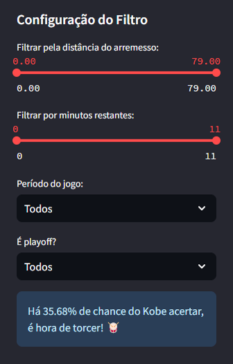
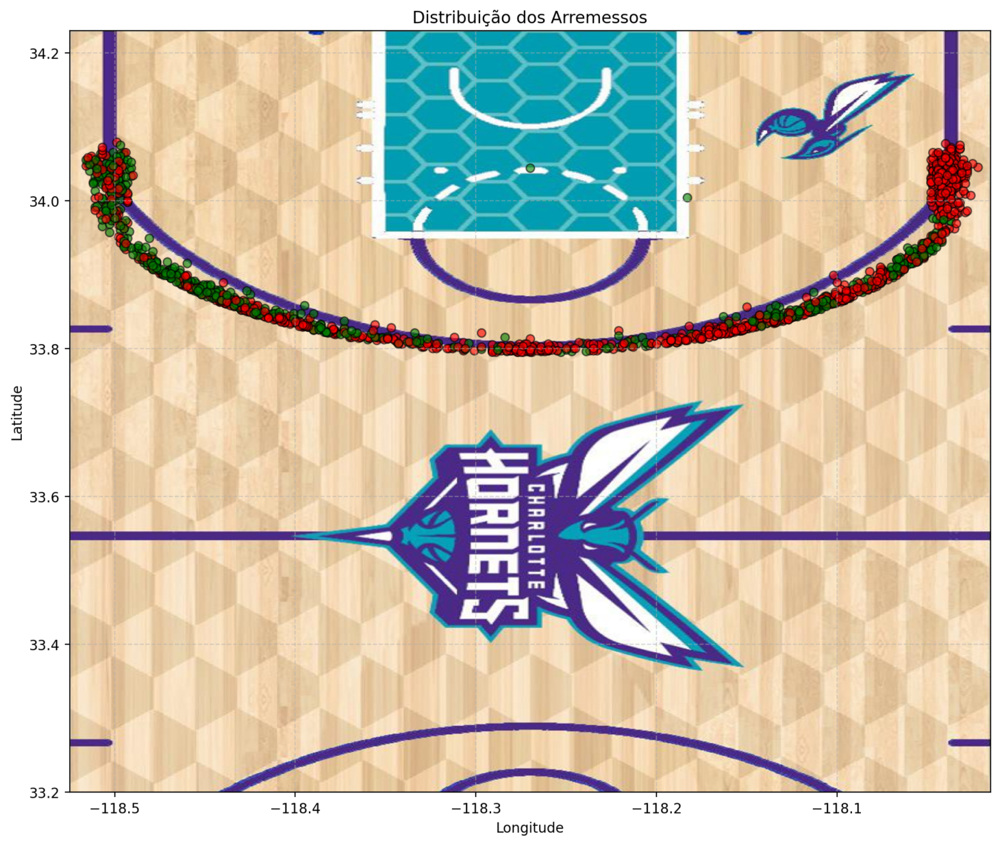

# Documentação do Streamlit

 
Documentação sobre o Streamlit, explicando como ele foi utilizado no projeto para criar dashboards interativos, monitorar resultados e visualizar informações.
 
 
 

## Índice

- <a href='#contexto'>1. Contexto</a>
- <a href='#tecnologias'>2. Tecnologias</a>
- <a href='#principais-componentes'>3. Escolha do modelo
- <a href='#artefatos'>4. Elementos do dashboard
- <a href='#conclusões-gerais'>5. Conclusões gerais</a>
- <a href='#sobre-mim'>6. Sobre mim</a> 

## Contexto

O Streamlit foi utilizado no projeto para criar um dashboard interativo que permite acompanhar e visualizar os resultados das análises e inferências realizadas. A ferramenta possibilitou a integração de gráficos, tabelas dinâmicas e controles de filtragem, permitindo uma interação intuitiva com os dados do projeto Kobe Bryant. Com uma interface simples e funcional, o Streamlit foi essencial para transformar o pipeline em uma aplicação acessível a desenvolvedores e stakeholders.

## Tecnologias

 Anaconda v. 23.7.4

 Jupyter Notebook v. 5.7.2

 Python v. 3.11.11

Principais bibliotecas:

-  Kedro 0.19.12

-  Matplotlib 3.7.5

-  MlFlow 2.12.2

-  Numpy 1.26.4

-  Pandas

-  Scikit-learn 1.4.2

-  Seaborn

-  Streamlit 1.44.1

## Escolha do modelo

⬆️ <a href='#índice'>Voltar ao início</a>

A Árvore de Decisão foi escolhida para o dashboard devido à melhor performance nos dados de produção, que contêm exclusivamente arremessos de 3 pontos. 

Enquanto a Regressão Logística previa todos os arremessos como erro, a Árvore de Decisão conseguiu identificar alguns acertos, trazendo maior equilíbrio e interatividade para a visualização dos resultados. Isso garantiu que o dashboard fosse mais representativo da realidade e informativo para o usuário.

## Elementos do dashboard

⬆️ <a href='#índice'>Voltar ao início</a>

O dashboard foi estruturado com diversos elementos interativos para facilitar a análise:

- **Slider para Distância do Arremesso**: Permite ajustar o intervalo de distâncias filtradas;

- **Slider para Minutos Restantes**: Controla o tempo restante de jogo para filtrar os arremessos;

- **Selectbox de Período do Jogo**: Filtra os dados por períodos específicos, como 1º ou 2º tempo;

- **Selectbox de Playoffs**: Permite alternar entre jogos eliminatórios e regulares;

 

- **Gráfico de dispersão**: Um gráfico de dispersão com a imagem da quadra de basquete ao fundo, que exibe a localização dos arremessos e suas predições (acerto ou erro) com cores diferentes. Ele é atualizado dinamicamente com base nos filtros selecionados.

 

Durante os treinamentos dos modelos de Regressão Logística e Árvore de Decisão, métricas como Logloss, acurácia, F1-score, precisão e recall foram calculadas e registradas, fornecendo uma visão clara da performance dos modelos. 

O tracking também permitiu armazenar gráficos de dispersão das predições e arquivos de validação, facilitando a análise dos resultados e a identificação do melhor modelo.

### Fluxo de projeto

⬆️ <a href='#índice'>Voltar ao início</a>

O MLflow Projects foi utilizado para estruturar o fluxo do projeto de forma organizada e reprodutível. Cada etapa do pipeline, desde o pré-processamento dos dados até a inferência, foi definida como um módulo claro e independente, permitindo que fosse executada e testada em ambientes diferentes. Isso garante que o projeto possa ser replicado.

### Modelos

⬆️ <a href='#índice'>Voltar ao início</a>

O registro e gerenciamento de modelos foram realizados por meio do componente Models. Após o treinamento dos modelos, eles foram salvos no formato .pkl, garantindo que as versões dos modelos fossem armazenadas e estivessem disponíveis para inferência futura. 

## Artefatos 

⬆️ <a href='#índice'>Voltar ao início</a>

Durante o desenvolvimento do projeto, diversos artefatos foram gerados ao longo das etapas do pipeline. Esses artefatos desempenham papéis fundamentais na análise, validação e inferência dos modelos.

### Métricas de validação

⬆️ <a href='#índice'>Voltar ao início</a>

Capturam os resultados das avaliações de desempenho dos modelos, como acurácia, F1-score e Logloss, e são salvos em formatos como '.csv'. Esses arquivos permitem análises e comparações entre os modelos, auxiliando na escolha do melhor candidato.

### Modelos treinados

⬆️ <a href='#índice'>Voltar ao início</a>

Os modelos de Regressão Logística e Árvore de Decisão são armazenados em arquivos '.pkl'. Esses artefatos são fundamentais para inferências futuras, garantindo reprodutibilidade e acesso às versões validadas.

### Gráficos de predições

⬆️ <a href='#índice'>Voltar ao início</a>

Gerados para visualizar os resultados das inferências, os gráficos exibem a distribuição das predições e são salvos como imagens 'scatter.png'. Eles fornecem uma representação visual clara da performance dos modelos.

 

### Arquivos de inferência

São arquivos '.csv' que contêm as previsões feitas pelos modelos aplicados aos dados de produção. Esses artefatos incluem também as colunas utilizadas para inferência, servindo como base para análise dos resultados finais.

## Outras considerações

⬆️ <a href='#índice'>Voltar ao início</a>

Demais considerações estarão presentes na documentação sobre pipeline e no README.md geral do projeto.

## Conclusões Gerais

⬆️ <a href='#índice'>Voltar ao início</a>

O uso do MLflow no projeto foi essencial para organizar e monitorar todas as etapas do ciclo de vida de machine learning. Ele garantiu rastreabilidade, permitindo revisões detalhadas dos experimentos e resultados. Essa abordagem mostrou-se valiosa para reprodutibilidade e análise, criando um fluxo de trabalho robusto e transparente para o desenvolvimento e aplicação de modelos preditivos.

## Sobre mim

⬆️ <a href='#índice'>Voltar ao início</a>

    
    

        

            
            Mateus Teixeira
        

        Cientista de dados
         
        Pós-graduando em Inteligência Artifcial pela INFNET
         
         
        
        
        
    

