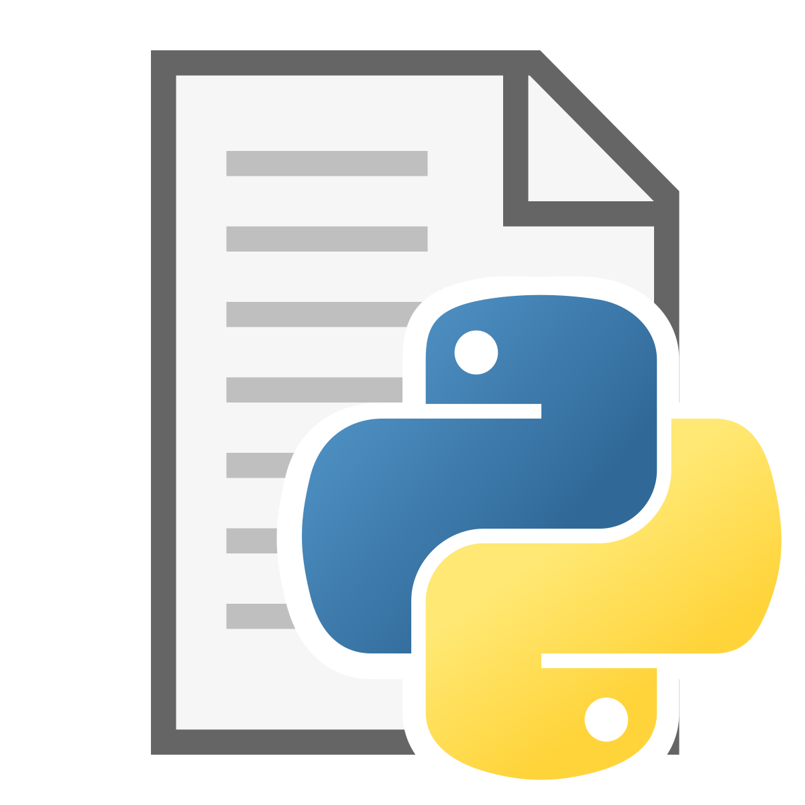

# Projeto de Disciplina de Inteligência Artificial generativa para linguagem (Large Language Model) [25E2_3]

 
Projeto desenvolvido na disciplina de LLM para Aplicações Práticas em IA, com foco em reconhecimento de entidades nomeadas (NER) em notícias e análise de organizações mencionadas em textos jornalísticos.

 
 
 

## Índice

- <a href='#contexto'>1. Contexto</a>
- <a href='#tecnologias'>2. Tecnologias</a>
- <a href='#fluxograma-do-projeto'>3. Fluxograma do projeto</a>
    - <a href='#parte-01-pegar-os-dados'>3.1. Pegar os dados
    - <a href='#parte-02-processamento-inicial-dos-textos'>3.2. Processamento inicial dos textos
    - <a href='#parte-03-aplicação-do-modelo-de-ner'>3.3. Aplicação do modelo de NER
    - <a href='#parte-04-extração-de-organizações'>3.4. Extração de organizações
    - <a href='#parte-05-análise-estatística-e-visualização'>3.5. Análise estatística e visualização
- <a href='#conclusões-gerais'>4. Conclusões gerais</a>
- <a href='#sobre-mim'>5. Sobre mim</a> 

## Contexto

Este projeto foi desenvolvido no contexto da disciplina de Inteligência Artificial Generativa para Linguagem (Large Language Model), e visa aplicar técnicas de reconhecimento de entidades nomeadas (NER) em textos jornalísticos em português. 

A partir do modelo `monilouise/ner_pt_br`, foram extraídas entidades de notícias da seção “Mercado” da Folha UOL, publicadas no primeiro trimestre de 2015. 

O objetivo foi identificar as organizações mais citadas no período, utilizando ferramentas de processamento de linguagem natural, visualização de dados e análise estatística para revelar padrões de menções no contexto econômico.

## Tecnologias

 Anaconda v. 23.7.4

 Jupyter Notebook v. 5.7.2

 Python v. 3.10.18

Principais bibliotecas:

-  Kaggle 1.7.4.5

-  Matplotlib 3.7.5

-  Numpy 1.26.4

-  Pandas 2.2.3

-  Pypi pip-tools

-  Scikit-learn 1.4.2

-  Seaborn 0.13.2

-  spaCy 3.8.4

-  tqdm 4.67.1

-  Wordcloud 1.9.4

## Fluxograma do projeto

O projeto segue o seguinte fluxograma (vamos mostrar por partes):

### Parte 01. Pegar os dados

⬆️ <a href='#índice'>Voltar ao início</a>

Os dados utilizados neste projeto foram obtidos a partir do Kaggle. O download foi realizado por meio de sua API, que permitiu acesso direto ao conjunto de notícias extraídas da seção "Mercado" da Folha UOL News Dataset.

Para isso, o comando `kaggle.api.dataset_download_files()` foi utilizado, garantindo que os arquivos fossem salvos no diretório especificado (`"../data/01-raw/"`). Esse processo facilita a manipulação dos dados no restante do pipeline de análise.

### Parte 02. Processamento inicial dos textos

⬆️ <a href='#índice'>Voltar ao início</a>

Os textos foram normalizados com limpeza básica: remoção de quebras de linha, caracteres indesejados e duplicidades. Foram também criadas colunas auxiliares para armazenar os resultados posteriores da etapa de NER.

### Parte 03. Aplicação do modelo de NER

⬆️ <a href='#índice'>Voltar ao início</a>

O modelo `monilouise/ner_pt_br`, baseado em transformers, foi aplicado para identificar entidades nomeadas nos textos. Essa etapa foi feita com pipeline do Hugging Face e uso de tqdm para monitorar o progresso.

### Parte 04. Extração de organizações

⬆️ <a href='#índice'>Voltar ao início</a>

A partir das entidades extraídas, foi feita a filtragem para reter apenas aquelas com classificação ligada a organizações (ORG). Também foi feita a reconstrução de tokens fragmentados (ex: “FG” + “##V”) e normalização dos nomes das entidades.

### Parte 05. Análise estatística e visualização

⬆️ <a href='#índice'>Voltar ao início</a>

Com os nomes de organizações limpos, foi gerado um ranking com as mais citadas. A visualização dos dados incluiu gráficos de barras e nuvens de palavras para destacar as principais instituições mencionadas.

## Conclusões Gerais

⬆️ <a href='#índice'>Voltar ao início</a>

Este projeto demonstrou a aplicação prática de modelos de linguagem para reconhecimento de entidades nomeadas em textos jornalísticos em português. Utilizando o modelo monilouise/ner_pt_br, foi possível identificar e filtrar organizações a partir das notícias da editoria “Mercado” da Folha UOL no primeiro trimestre de 2015, com foco na contagem e visualização das instituições mais citadas.

O processo incluiu etapas de coleta, limpeza, aplicação do modelo, reconstrução de tokens e análise estatística das entidades extraídas. As visualizações ajudaram a tornar os padrões mais visíveis e permitiram avaliar os dados de forma mais direta. O projeto também evidenciou limitações pontuais do modelo, como a fragmentação de nomes ou identificação imprecisa, indicando pontos a melhorar em futuros trabalhos

## Sobre mim

⬆️ <a href='#índice'>Voltar ao início</a>

    
    Mateus Teixeira

Cientista de dados
 
Pós-graduando em Inteligência Artifcial pela INFNET
 
 

