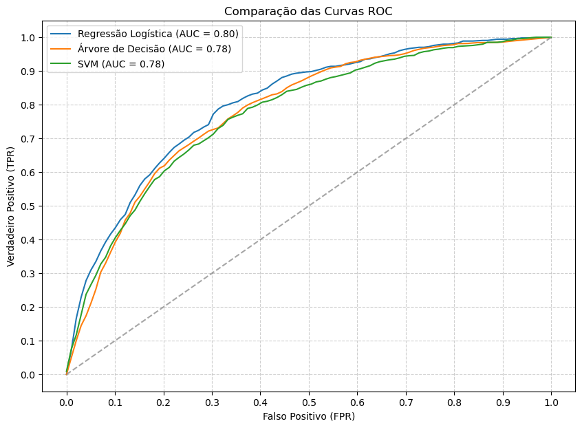

# Projeto de Disciplina de Algoritmos de Inteligência Artificial para Classificação

Este projeto faz parte da disciplina de Algoritmos de Inteligência Artificial para Classificação e tem como objetivo aplicar técnicas de aprendizado supervisionado para a classificação da qualidade de vinhos com base em suas características físico-químicas.

## Índice

- <a href='#contexto'>1. Contexto</a>
- <a href='#tecnologias'>2. Tecnologias</a>
- <a href='#análise-exploratória'>3. Análise Exploratória</a>
- <a href='#modelagem'>4. Modelagem
    - <a href='#regressão-logística-logistic-regression'>4.1. Regressão Logística (Logistic Regression)
    - <a href='#árvore-de-decisão-decision-tree'>4.2. Árvore de Decisão (Decision Tree)
    - <a href='#máquinas-suportadas-por-vetores-support-vector-machine---svm'>4.3. Máquinas Suportadas por Vetores (Support Vector Machine - SVM)
- <a href='#métricas-de-validação'>5. Métricas de validação
    - <a href='#validação-cruzada-k-fold'>5.1. Validação Cruzada (K-Fold)
    - <a href='#acurácia'>5.2. Acurácia
    - <a href='#precisão'>5.3. Precisão
    - <a href='#recall-sensibilidade'>5.4. Recall (Sensibilidade)
    - <a href='#f1-score'>5.5. F1-Score
    - <a href='#auc-roc-área-sob-a-curva-roc'>5.6. AUC-ROC (Área sob a Curva ROC)
- <a href='#comparação-entre-os-modelos'>6. Comparação entre os modelos
- <a href='#conclusões-gerais'>7. Conclusões gerais</a>
- <a href='#sobre-mim'>8. Sobre mim</a> 

## Contexto

Este projeto foi desenvolvido como parte da disciplina de Algoritmos de Inteligência Artificial para Classificação. O objetivo principal é construir e avaliar modelos de machine learning capazes de classificar vinhos portugueses (tintos e brancos) com base em suas características físico-químicas.

Os dados utilizados foram extraídos do artigo:

- P. Cortez, A. Cerdeira, F. Almeida, T. Matos and J. Reis. _Modeling wine preferences by data mining from physicochemical properties_. In Decision Support Systems, Elsevier, 47(4):547-553, 2009.

A base contém diversas variáveis relacionadas à composição química dos vinhos e sua qualidade, avaliada em uma escala de 0 a 10. Para simplificar a classificação, a variável quality foi transformada na variável categórica opinion, onde:

- **0** → Vinhos considerados de qualidade inferior ou igual a 5;

- **1** → Vinhos considerados de qualidade superior a 5

O foco do estudo foi determinar a eficiência de diferentes modelos na classificação de vinhos com base nesses atributos, considerando métricas como F1-score e AUC-ROC.

## Tecnologias

 Anaconda v. 23.7.4

 Jupyter Notebook v. 5.7.2

 Python v. 3.12.4

Principais bibliotecas:

-  Matplotlib

-  Numpy

-  Pandas

-  Scikit-learn

-  Seaborn

## Análise Exploratória

⬆️ <a href='#índice'>Voltar ao início</a>

A análise exploratória revelou informações importantes sobre a base de dados. O conjunto de dados contém vinhos tintos e brancos e apresenta diversas variáveis físico-químicas, como acidez, teor alcoólico, nível de açúcar residual, pH e concentração de dióxido de enxofre. A variável original de qualidade (quality) foi convertida em uma variável categórica chamada opinion, onde vinhos com nota menor ou igual a 5 foram classificados como ruins (0) e os demais como bons (1).

Durante a análise, foram identificados valores nulos em sete colunas, além de linhas duplicadas, que foram removidas. Para lidar com os dados ausentes, foi aplicada uma estratégia de preenchimento baseada na média ou mediana, dependendo da distribuição dos valores.

O balanceamento dos dados também foi analisado, revelando que os vinhos brancos são mais desbalanceados (com predominância de vinhos de baixa qualidade), enquanto os vinhos tintos possuem uma distribuição mais equilibrada entre vinhos bons e ruins.

### Modelagem

⬆️ <a href='#índice'>Voltar ao início</a>

Para a classificação dos vinhos, foram testados três modelos de machine learning: Regressão Logística, Árvore de Decisão e Support Vector Machine (SVM).

### Regressão Logística (Logistic Regression)

A Regressão Logística é um modelo estatístico usado para problemas de classificação binária. Ele estima a probabilidade de uma amostra pertencer a uma classe específica usando uma função sigmoide. Esse modelo é eficiente, rápido e fornece probabilidades bem calibradas, o que facilita a interpretação dos resultados.

No experimento, a Regressão Logística foi treinada com validação cruzada estratificada usando K-Fold (k=10). Além disso, foram testados diferentes hiperparâmetros, utilizando o Grid Search para encontrar a melhor configuração do modelo.

### Árvore de Decisão (Decision Tree)

A Árvore de Decisão é um modelo baseado em regras de decisão hierárquicas, onde os dados são divididos de forma sucessiva com base em critérios como gini ou entropia. Esse modelo é altamente interpretável, mas pode sofrer de overfitting se não for corretamente ajustado.

Para melhorar o desempenho da Árvore de Decisão, foram testados hiperparâmetros como profundidade máxima, número mínimo de amostras por folha e critério de divisão. O ajuste foi feito utilizando Grid Search com validação cruzada K-Fold (k=10).

### Máquinas Suportadas por Vetores (Support Vector Machine - SVM)

O modelo SVM busca encontrar um hiperplano de separação ótimo entre as classes, maximizando a margem entre os dados. Quando os dados não são linearmente separáveis, o SVM utiliza funções kernel (como RBF e polinomial) para mapear os dados para um espaço dimensional maior, onde a separação seja possível.

A SVM geralmente é um modelo mais computacionalmente custoso, especialmente em grandes volumes de dados. Para otimizar seu desempenho, foram ajustados hiperparâmetros como tipo de kernel, parâmetro C (penalização) e gamma, utilizando Grid Search com validação cruzada K-Fold (k=10).

## Métricas de Validação

⬆️ <a href='#índice'>Voltar ao início</a>

Para avaliar o desempenho dos modelos de classificação, foram utilizadas cinco métricas principais: acurácia, precisão, recall, F1-score e AUC-ROC. Cada uma dessas métricas fornece uma visão diferente sobre a performance dos modelos, permitindo uma análise mais completa, especialmente considerando o desbalanceamento da base de dados.

### Validação Cruzada (K-Fold)

A validação cruzada estratificada (Stratified K-Fold) foi aplicada com k=10, garantindo que a distribuição das classes fosse mantida em todas as divisões do conjunto de treino e teste. Essa técnica permite avaliar o desempenho do modelo de forma mais confiável, reduzindo a influência de uma divisão específica dos dados.

### Acurácia

A acurácia mede a proporção total de classificações corretas feitas pelo modelo em relação ao total de observações. Ela é frequentemente usada como métrica principal em problemas de classificação, mas pode ser enganosa quando há desbalanceamento de classes. Isso ocorre porque um modelo pode parecer ter um bom desempenho apenas por favorecer a classe majoritária.

A acurácia foi calculada para cada modelo, servindo como uma métrica geral de desempenho. No entanto, devido ao desbalanceamento dos dados, ela não foi usada isoladamente para escolher o melhor modelo.

### Precisão

A precisão (precision) mede a proporção de previsões positivas que realmente pertencem à classe positiva. Em outras palavras, indica quantos dos vinhos classificados como "bons" realmente possuem alta qualidade. Essa métrica é essencial em cenários onde falsos positivos podem ser problemáticos, ou seja, quando um erro pode levar a decisões equivocadas, como recomendar um vinho de baixa qualidade como se fosse premium.

No projeto, a precisão foi usada para avaliar se os modelos estavam classificando corretamente os vinhos de qualidade superior. Como a base de dados era desbalanceada, um modelo com alta precisão pode indicar que ele é conservador e evita atribuir rótulos positivos quando há incerteza.

### Recall (Sensibilidade)

O recall (ou sensibilidade) mede a proporção de amostras realmente positivas que foram corretamente classificadas pelo modelo. Ele indica a capacidade do modelo de identificar corretamente todos os vinhos de qualidade superior. Essa métrica é especialmente importante quando o objetivo é minimizar falsos negativos, ou seja, evitar que vinhos bons sejam classificados erroneamente como ruins.

O recall foi essencial para garantir que vinhos de boa qualidade não fossem subestimados pelo modelo. Como havia um desbalanceamento na base de dados, o recall ajudou a verificar se os modelos estavam conseguindo detectar corretamente a minoria dos vinhos classificados como bons.

### F1-score

O F1-score é a média harmônica entre a precisão e o recall, fornecendo um equilíbrio entre essas duas métricas. Ele é especialmente útil quando há um trade-off entre minimizar falsos positivos e falsos negativos. Um F1-score alto indica que o modelo tem um bom desempenho tanto na identificação dos vinhos bons quanto na redução de erros na classificação.

Como a base de dados era desbalanceada, o F1-score foi escolhido como a métrica principal para comparar os modelos. Ele ajudou a encontrar o modelo que conseguia equilibrar bem a classificação correta dos vinhos bons sem comprometer a precisão ou o recall.

### AUC-ROC (Área Sob a Curva ROC)

A métrica AUC-ROC (Área Sob a Curva ROC) mede a capacidade do modelo de distinguir entre as classes positiva e negativa. A curva ROC (Receiver Operating Characteristic) compara a taxa de verdadeiros positivos (sensibilidade) com a taxa de falsos positivos. O valor do AUC (Área sob a curva) varia de 0 a 1, onde 1 representa um modelo perfeito e 0.5 indica um modelo aleatório.

A AUC-ROC foi usada para avaliar quão bem os modelos diferenciavam os vinhos bons dos ruins. Um modelo com AUC próximo de 1 indicava uma separação clara entre as classes, enquanto valores mais baixos mostravam dificuldades na classificação. Essa métrica foi útil para entender a performance global do modelo independentemente do limiar de decisão.

  

## Comparação entre os Modelos

⬆️ <a href='#índice'>Voltar ao início</a>

A Regressão Logística apresentou os melhores resultados gerais, com um F1-score de 63,77% no treino e 64,63% no teste, além de uma AUC-ROC de 80,30%. Seu desempenho consistente, aliado à interpretabilidade e eficiência computacional, faz dela uma opção robusta para classificação de vinhos.

A Árvore de Decisão teve um F1-score de 60,12% no treino e 58,79% no teste, mostrando boa capacidade de aprendizado, mas com tendência ao overfitting. Ajustes nos hiperparâmetros ajudaram a melhorar sua generalização, tornando-a uma alternativa viável para aplicações explicáveis.

O Support Vector Machine (SVM) obteve o melhor desempenho em separabilidade das classes, com F1-score de 66,45% no treino e 65,98% no teste, além da maior AUC-ROC (83,75%). No entanto, o alto custo computacional e a necessidade de ajuste fino dos hiperparâmetros podem limitar sua aplicação prática.

A escolha do modelo depende do contexto. A Regressão Logística é a melhor opção para um equilíbrio entre desempenho e simplicidade. A SVM se destaca pela alta precisão, enquanto a Árvore de Decisão oferece interpretabilidade, mas exige otimização para evitar overfitting.

## Conclusões Gerais

⬆️ <a href='#índice'>Voltar ao início</a>

Os resultados da modelagem demonstraram que diferentes modelos podem oferecer vantagens distintas dependendo do critério avaliado. Além disso, a análise dos dados reforçou a importância do tratamento de dados ausentes e do balanceamento das classes, fatores que podem impactar diretamente na qualidade da classificação.

Foi possível identificar que os vinhos classificados como bons (opinion = 1) tendem a apresentar maior teor alcoólico e menor acidez volátil, enquanto os vinhos considerados ruins (opinion = 0) apresentam características opostas. Isso sugere que a composição química do vinho tem influência direta na percepção de qualidade.

Em aplicações reais, o modelo escolhido deve levar em conta não apenas as métricas de desempenho, mas também a interpretabilidade e a aplicabilidade no contexto do problema. Em um ambiente comercial, por exemplo, um modelo mais explicável pode ser preferível a um modelo mais complexo que exige maior esforço computacional e dificulta a justificativa das decisões.

Por fim, o projeto permitiu um aprofundamento prático nos conceitos de classificação supervisionada, destacando a importância da escolha das métricas adequadas e das técnicas de validação para garantir modelos robustos e eficazes. 

## Sobre mim

⬆️ <a href='#índice'>Voltar ao início</a>

    
    

        
Mateus Teixeira

        Cientista de dados
         
        Pós-graduando em Inteligência Artifcial pela INFNET
         
         
        
        
        
    

