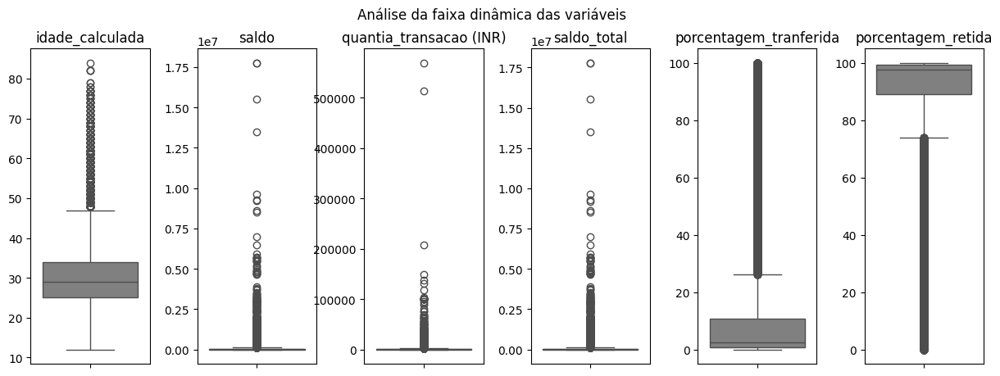
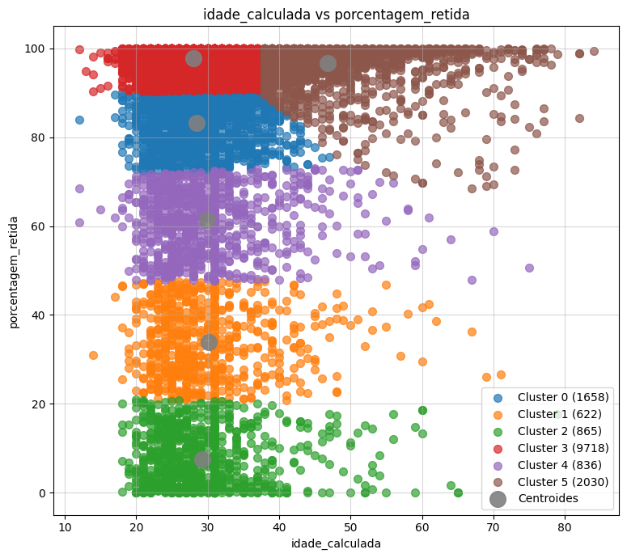
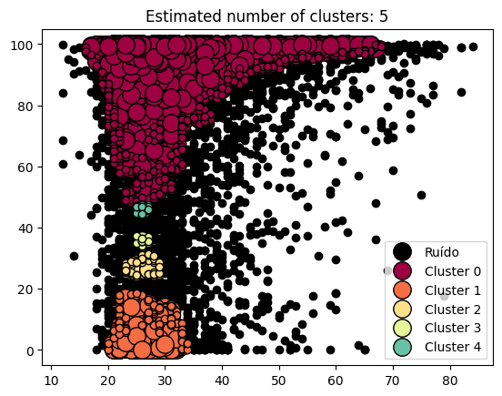

# Projeto de Disciplina de Validação de Modelos de Clusterização

Projeto desenvolvido para validar a segmentação de dados realizada por modelos de aprendizado não supervisionado. A validação é um passo fundamental para garantir que os grupos formados possuam significado e aplicabilidade prática.

## Índice

- <a href='#contexto'>1. Contexto</a>
- <a href='#tecnologias'>2. Tecnologias</a>
- <a href='#análise-exploratória'>3. Análise exploratória</a>
- <a href='#modelagem'>4. Modelagem</a>
    - <a href='#k-means'>4.1. K-Means</a>
    - <a href='#dbscan'>4.2. DBSCAN</a>
- <a href='#métricas-de-validação'>5. Métricas de validação</a>
    - <a href='#índice-de-silhueta'>5.1. Índice de Silhueta</a>
    - <a href='#índice-davies-bouldin'>5.2. Índice Davies-Bouldin</a>
    - <a href='#índice-calinski-harabasz'>5.3. Índice Calinski-Harabasz</a>
- <a href='#comparação-entre-os-modelos'>6. Comparação entre os modelos
- <a href='#conclusões-gerais'>7. Conclusões gerais</a>
    - <a href='#conclusões-da-análise-do-k-means'>7.1. Conclusões da análise do K-Means</a>
    - <a href='#conclusões-da-análise-do-dbscan'>7.2. Conclusões da análise do DBSCAN</a>
- <a href='#sobre-mim'>8. Sobre mim</a> 

## Contexto

⬆️ <a href='#índice'>Voltar ao início</a>

A clusterização é uma técnica utilizada para segmentar dados com base em suas características, permitindo identificar padrões e estruturar grupos de forma automática. No entanto, para que esses agrupamentos sejam úteis, é essencial validar sua qualidade. Este projeto tem como objetivo aplicar diferentes modelos de clusterização e avaliar seus resultados utilizando métricas apropriadas.

Os dados analisados consistem em transações bancárias realizadas por clientes, contendo informações relevantes como idade, saldo bancário e valores transacionados. A validação desses clusters ajuda a identificar perfis de clientes, avaliar riscos e criar estratégias personalizadas para cada grupo.

O arquivo possui as seguintes colunas:

- _id_transacao_ (TransactionID): Id da transferência feita
- _id_cliente_ (CustomerID): Id do cliente
- _idade_calculada_ (CustomerDOB): Idade do cliente no período da transferência
- _genero_ (CustGender): Gênero sexual do cliente
- _localizazao_ (CustLocation): Localização do cliente
- _saldo_ (CustAccountBalance): Saldo da conta do cliente após a transferência
- _data_transacao_ (TransactionDate): Data da transferência
- _hora_transacao_ (TransactionTime): Hora da transferência em timestamp Unix (o número de segundos que se passaram desde a data da coluna anterior)
- _quantia_transacao (INR)_ (TransactionAmount (INR)): Valor da transferência em rúpias indianas (INR)

## Tecnologias

 Anaconda v. 23.7.4 (ambiente virtual chamado '⚙️ venv_clusterizacao2')

 Jupyter Notebook v. 5.7.2

 Python v. 3.11.11

Principais bibliotecas:

-  Matplotlib

-  Numpy

-  Pandas

-  Scikit-learn

-  Scipy

-  Seaborn

## Análise Exploratória

⬆️ <a href='#índice'>Voltar ao início</a>

Antes de aplicar os modelos de clusterização, realizamos uma análise exploratória dos dados para entender sua distribuição e identificar possíveis outliers. Foram utilizados boxplots para visualizar a dispersão das variáveis numéricas, permitindo observar padrões como a variação dos saldos dos clientes e os valores das transações.

Os gráficos revelaram que algumas variáveis apresentavam grande variação, sugerindo a presença de valores discrepantes que poderiam influenciar os agrupamentos. Essa análise inicial foi fundamental para ajustar os parâmetros dos modelos e garantir uma segmentação mais precisa dos clientes.

  

## Modelagem

⬆️ <a href='#índice'>Voltar ao início</a>

### K-Means

O K-Means é um algoritmo de clusterização que busca dividir os dados em grupos homogêneos com base na minimização da variância interna de cada cluster. Ele utiliza um número pré-definido de clusters e atualiza os centróides até a convergência.

Neste projeto, implementei o K-Means para segmentar os clientes com base no saldo da conta e nos valores transacionados. A análise dos clusters revelou padrões distintos, indicando diferentes perfis de clientes. Foi possível identificar grupos com maior retenção de saldo e outros que realizam transações mais frequentes.

  

### DBSCAN

O DBSCAN (Density-Based Spatial Clustering of Applications with Noise) é um modelo que identifica clusters com base na densidade dos dados. Ele não requer um número fixo de clusters e é eficiente na detecção de outliers.

No projeto, o DBSCAN foi aplicado para identificar padrões de transação e segmentar clientes de acordo com seu comportamento. O modelo foi eficaz na separação de clientes com movimentações atípicas, isolando-os como outliers. Entretanto, a escolha dos hiperparâmetros eps e MinPts foi determinante para a qualidade dos agrupamentos.

  

## Métricas de validação

⬆️ <a href='#índice'>Voltar ao início</a>

### Índice de Silhueta

O índice de Silhueta mede a qualidade dos clusters avaliando a separação entre os grupos e a coesão interna. Quanto maior o valor, melhor a segmentação dos dados. Foi aplicado para comparar K-Means e DBSCAN, indicando que o K-Means apresentou melhores resultados em termos de separação entre os clusters.

### Índice Davies-Bouldin

O índice Davies-Bouldin avalia a compacidade e separação dos clusters. Valores menores indicam uma melhor estruturação dos agrupamentos. Durante a análise, o K-Means obteve menor valor para essa métrica, sugerindo que os clusters estavam mais bem definidos.

### Índice Calinski-Harabasz

O índice Calinski-Harabasz mede a relação entre a variância entre clusters e a variância interna. Quanto maior o valor, melhor a separação dos grupos. Essa métrica foi aplicada para validar a escolha do número de clusters no K-Means, reforçando a eficácia do modelo para essa base de dados.

## Comparação entre os Modelos

⬆️ <a href='#índice'>Voltar ao início</a>

A análise comparativa mostrou que o K-Means foi mais eficiente para segmentações com grupos bem separados, principalmente quando os dados foram previamente normalizados. Ele apresentou maiores valores no índice de Silhueta, indicando que os clusters estavam bem definidos. No entanto, o modelo se mostrou sensível a outliers, já que valores extremos deslocam os centroides, impactando a qualidade da segmentação. Isso significa que, sem um pré-processamento adequado, alguns clientes podem ser erroneamente classificados em clusters diferentes.

Por outro lado, o DBSCAN se mostrou mais robusto na detecção de padrões atípicos e não exige a definição prévia do número de clusters. Sua principal vantagem foi a identificação de outliers automaticamente, algo que o K-Means não consegue fazer de forma nativa. No entanto, a escolha dos hiperparâmetros eps e MinPts foi crítica para garantir resultados significativos. Se mal ajustados, o modelo pode criar clusters muito fragmentados ou classificar grande parte dos dados como ruído. Assim, o DBSCAN se mostrou mais indicado para situações em que há distribuição desigual de dados e a presença de ruídos é um fator relevante.

## Conclusões gerais

⬆️ <a href='#índice'>Voltar ao início</a>

Os resultados indicam que o K-Means é ideal para segmentações mais estruturadas, enquanto o DBSCAN é útil para detectar padrões menos rígidos e outliers. Cada abordagem pode ser útil dependendo do objetivo da análise, permitindo diferentes estratégias para segmentação de clientes e análise de riscos.

### Conclusões da análise do K-Means

Da análise, pode-se depreender que o K-Means clusterizou os clientes da seguinte forma:

- Cluster 0: em sua maioria, homens de 22 a 31 anos de MUMBAI e BANGALORE, que retem cerca de 72% a 90% de seu saldo;

- Cluster 1: em sua maioria, homens de 22 a 33 anos de NEW DELHI e MUMBAI, que retem cerca de 20% a 47% de seu saldo;

- Cluster 2: em sua maioria, homens de 21 a 31 anos de MUMBAI e BANGALORE, que retem cerca de 0% a 20% de seu saldo;

- Cluster 3: em sua maioria, homens de 22 a 31 anos de MUMBAI e NEW DELHI, que retem cerca de 90% a 100% de seu saldo;

- Cluster 4: em sua maioria, homens de 22 a 31 anos de MUMBAI  e BANGALORE, que retem cerca de 47% a 73% de seu saldo;

- Cluster 5: em sua maioria, homens de 38 a 48 anos de MUMBAI e BANGALORE, que retem cerca de 68% a 100% de seu saldo;

Os clientes do _Cluster 0_, _Cluster 3_ e parte dos clientes do _Cluster 4_ e _Cluster 5_ possuem, em geral um ótimo perfil para oferecimento de produtos de investimento e linhas de crédito, pois retem boa parte de seu saldos bancários e suas contas (em torno de 68% a 100%), não oferecendo risco de inadimplência, por exemplo;

Os clientes do _Cluster 2_ e parte do _Cluster 1_ não são tão indicados para esses produtos, possuindo muito mais capital de giro do que retendo patrimônio (entre 0% e 20%), oferencendo um alto risco de inadimplência.

E ainda que não faça parte da moda, observou-se que os clientes mais velhos (de 60 a 85 anos) possuem uma maior retenção de seu saldo (entre 80% e 100%), como evidenciado no _Cluster 5_.

### Conclusões da análise do DBSCAN

O DBSCAN, por sua vez, agrupou os dados da seguinte forma:

- Cluster 0: em sua maioria, homens de 22 a 31 anos de MUMBAI e NEW DELHI, que retem cerca de 48% a 100% de seu saldo;

- Cluster 1: em sua maioria, homens de 22 a 31 anos de MUMBAI e BANGALORE, que retem cerca de 0% a 18% de seu saldo;

- Cluster 2: em sua maioria, homens de 23 a 29 anos de NEW DELHI e DELHI, que retem cerca de 24% a 31% de seu saldo;

- Cluster 3: em sua maioria, homens de 25 a 27 anos de NEW DELHI e BANGALORE, que retem cerca de 34% a 37% de seu saldo;

- Cluster 4: em sua maioria, homens de 25 a 27 anos de NEW DEHLI e DEHLI, que retem cerca de 44% a 47% de seu saldo;

Segundo o DBSCAN, os clientes do _Cluster 1_ e do _Cluster 2_ são clientes que possuem um alto capital de giro e não retem quase nada de seu patrimônio.

Já os clientes do _Cluster 0_ são clientes que retem muito mais patrimônio, sendo mais indicados para oferecer produtos de investimento e também confirmando o perfil traçado pelo KMeans.

Comparando os resultados, o Cluster 0 do DBSCAN se alinha ao Cluster 3 do K-Means, ambos representando clientes com alta retenção de saldo. Já os Clusters 1 e 2 do DBSCAN correspondem ao Cluster 2 do K-Means, que reúne clientes com maior giro de capital. A principal diferença é que o DBSCAN identificou automaticamente clientes fora do padrão, enquanto o K-Means exigiu definição prévia do número de clusters.

Essa análise permite utilizar os clusters para diferentes estratégias bancárias. Os clientes com alta retenção de saldo podem ser indicados para produtos de investimento e crédito, enquanto aqueles com baixo saldo e alta movimentação exigem mais cautela na concessão de crédito, podendo representar um risco maior de inadimplência.

## Sobre mim

⬆️ <a href='#índice'>Voltar ao início</a>

    
    

        
Mateus Teixeira

        Cientista de dados
         
        Pós-graduando em Inteligência Artifcial pela INFNET
         
         
        
        
        
    

