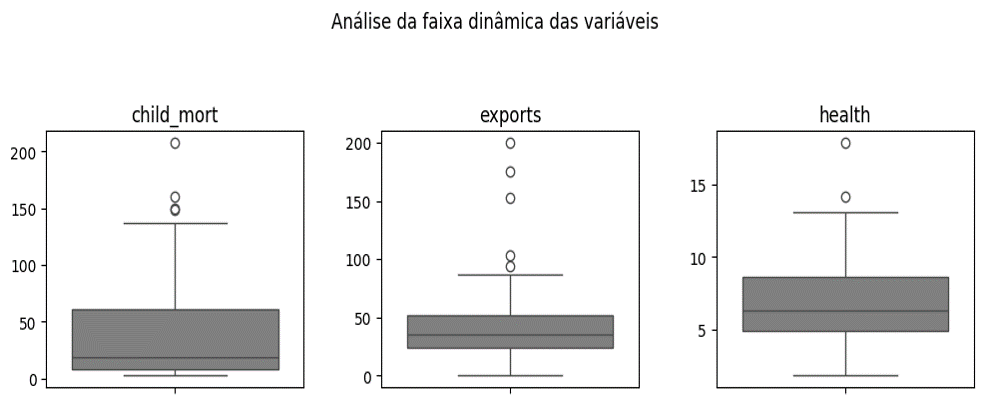
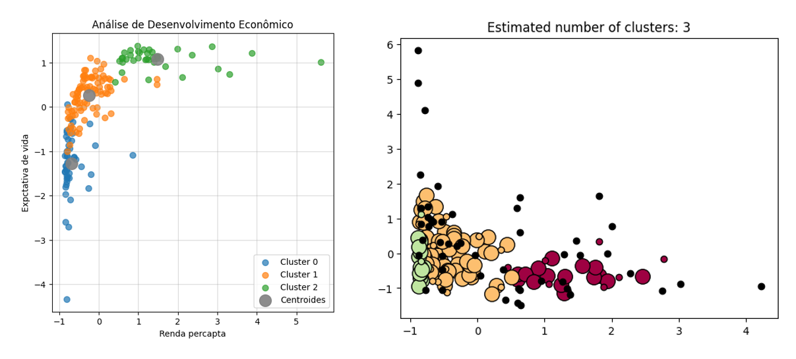

# Projeto de Disciplina de Algoritmos de Inteligência Artificial para Clusterização

Este projeto foi desenvolvido como parte da disciplina de Algoritmos de Inteligência Artificial, com o objetivo de aplicar técnicas de aprendizado não supervisionado para análise e agrupamento de dados. 

Durante o desenvolvimento, aprendi a utilizar diferentes modelos de clusterização, compreendendo suas particularidades, vantagens e desafios na interpretação dos resultados.

## Índice

- <a href='#tecnologias'>1. Tecnologias</a>
- <a href='#contexto'>2. Contexto</a>
- <a href='#análises'>3. Análises</a>
    - <a href='#k-means-k-means-clustering'>3.1. K-means</a>
    - <a href='#k-medoid-k-medoid-clustering'>3.2. K-medoid</a>
    - <a href='#dbscan-density-based-spatial-clustering-of-applications-with-noise'>3.3. DBSCAN</a>
    - <a href='#clusterização-hierárquica-hcluster---hierarchical-clustering'>3.4. HCluster</a>
- <a href='#sobre-mim'>4. Sobre mim</a>

## Tecnologias

 Anaconda v. 23.7.4 (ambiente virtual chamado '⚙️ venv_clusterizacao2')

 Jupyter Notebook v. 5.7.2

 Python v. 3.10.5

Principais bibliotecas:

-  Numpy v. 1.26.4 (para fins de compatibilidade)

-  Pandas

-  Scikit-learn

-  Seaborn

## Contexto

⬆️ <a href='#índice'>Voltar ao início</a>

O objetivo deste projeto foi explorar algoritmos de clusterização para analisar um conjunto de dados contendo informações econômicas e políticas sobre diversos países, disponibilizado no arquivo '🌎 country-data.csv'.

A clusterização é uma técnica essencial em aprendizado não supervisionado, pois permite identificar padrões ocultos e agrupar dados semelhantes sem a necessidade de rótulos prévios. Durante o desenvolvimento do projeto, foi possível aprofundar o conhecimento sobre diferentes abordagens de agrupamento, suas vantagens e desafios, além de avaliar a aplicabilidade de cada método ao conjunto de dados.

A primeira etapa do projeto consistiu na análise exploratória dos dados, com destaque para a verificação da distribuição dos valores e a detecção de outliers por meio de boxplots:

  

Em seguida, foram implementados e comparados quatro algoritmos de clusterização:

- <a href='#k-means-k-means-clustering'>K-Means</a>: que agrupa os dados com base em centroides ajustados iterativamente;

- <a href='#k-medoid-k-medoid-clustering'>K-Medoid</a>: similar ao K-Means, mas garantindo que os centros dos clusters sejam pontos reais do conjunto de dados;

- <a href='#clusterização-hierárquica-hcluster---hierarchical-clustering'>Clusterização Hierárquica (HCluster)</a>: que estrutura os agrupamentos em níveis hierárquicos sem necessidade de um número inicial de clusters;

- <a href='#dbscan-density-based-spatial-clustering-of-applications-with-noise'>DBSCAN</a>: que identifica grupos densos de dados e separa outliers de forma automática.

Cada modelo foi avaliado e comparado por meio de gráficos de dispersão e dendrogramas, permitindo compreender suas diferenças e aplicações.

## Análises

⬆️ <a href='#índice'>Voltar ao início</a>

### K-Means (K-Means Clustering)

O K-Means foi o primeiro modelo testado, sendo amplamente utilizado devido à sua eficiência na criação de clusters bem definidos. O algoritmo inicia distribuindo aleatoriamente K centroides no espaço de dados e, a cada iteração, ajusta sua posição com base nos elementos atribuídos a cada grupo. Para encontrar o número ideal de clusters, utilizamos a técnica do "cotovelo", que avalia a variação da inércia à medida que K aumenta. No entanto, observamos que o método é sensível à escolha inicial dos centroides, podendo levar a agrupamentos inconsistentes caso os pontos iniciais não estejam bem distribuídos.

Outro desafio encontrado foi a presença de outliers, que influenciam significativamente a formação dos clusters. Como o K-Means minimiza a soma das distâncias quadradas dos pontos aos seus centroides, elementos muito distantes acabam deslocando os grupos, o que pode gerar agrupamentos distorcidos. Uma possível solução seria utilizar uma abordagem mais robusta, como o K-Medoid, que substitui os centroides por pontos reais do conjunto de dados.

### K-Medoid (K-Medoid Clustering)

⬆️ <a href='#índice'>Voltar ao início</a>

O K-Medoid funciona de maneira semelhante ao K-Means, mas se diferencia por sempre escolher pontos reais como medoides, evitando que valores extremos distorçam os agrupamentos. Essa característica torna o algoritmo mais robusto a outliers, já que os pontos centrais de cada cluster não podem ser influenciados por valores extremos. 

Durante os testes, percebemos que a distribuição dos dados afeta diretamente a estabilidade do modelo, sendo necessário um ajuste cuidadoso do número de clusters para obter bons resultados.

Entretanto, um dos desafios do K-Medoid é seu maior custo computacional. Como o algoritmo precisa calcular a distância de cada ponto para todos os demais em busca do medoide ideal, ele se torna mais lento em grandes conjuntos de dados. Apesar disso, a melhor estabilidade na definição dos clusters pode compensar essa limitação, tornando-o uma alternativa viável quando há presença de ruído nos dados.

### Clusterização Hierárquica (HCluster - Hierarchical Clustering)

⬆️ <a href='#índice'>Voltar ao início</a>

A Clusterização Hierárquica não requer a definição prévia do número de clusters, o que a torna útil para explorar a estrutura dos dados antes de decidir a melhor configuração de agrupamento. Utilizamos um dendrograma para visualizar as relações entre os elementos, o que facilitou a compreensão de como os países poderiam ser agrupados de forma natural. Diferentes critérios de ligação foram testados, como single linkage, complete linkage e average linkage, sendo que cada um influenciou a forma como os clusters foram formados.

Um dos principais desafios dessa abordagem foi sua complexidade computacional, já que o algoritmo requer um número elevado de comparações para formar a hierarquia de agrupamentos. Além disso, dependendo da métrica de distância utilizada, os resultados podem variar significativamente. No entanto, a clusterização hierárquica se mostrou uma ferramenta valiosa para explorar os padrões do conjunto de dados antes de aplicar métodos mais específicos.

  

### DBSCAN (Density-Based Spatial Clustering of Applications with Noise)

⬆️ <a href='#índice'>Voltar ao início</a>

O DBSCAN se destacou por sua capacidade de detectar clusters de diferentes formas e tamanhos, ao contrário dos métodos baseados em centroides. Esse algoritmo agrupa pontos densamente conectados e identifica aqueles que estão isolados como outliers. Durante os testes, ajustamos os hiperparâmetros Eps (raio de busca) e MinPts (quantidade mínima de pontos para formar um cluster), percebendo que pequenas variações nesses valores resultam em mudanças significativas nos agrupamentos.

Apesar da flexibilidade, o DBSCAN teve dificuldades quando os dados apresentaram variações de densidade muito grandes. Enquanto algumas áreas do espaço de dados eram corretamente agrupadas, outras ficavam mal definidas devido à falta de um critério uniforme para diferentes regiões. No entanto, o algoritmo foi eficaz na identificação de anomalias, o que pode ser útil para análises mais detalhadas de padrões irregulares.

  

## Sobre mim

⬆️ <a href='#índice'>Voltar ao início</a>

    
    

        
Mateus Teixeira

        Cientista de dados
         
        Pós-graduando em Inteligência Artifcial pela INFNET
         
         
        
        
        
    

