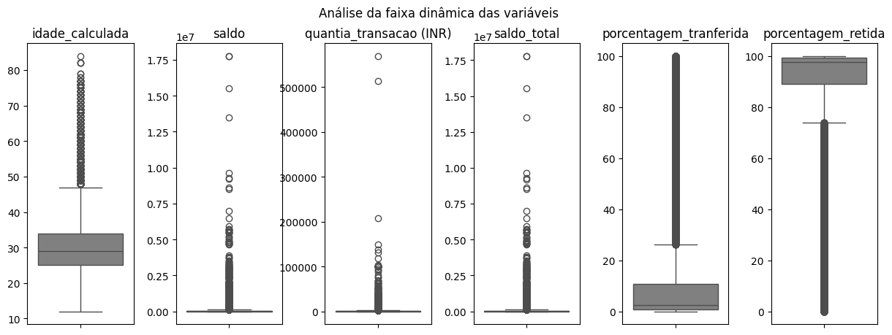
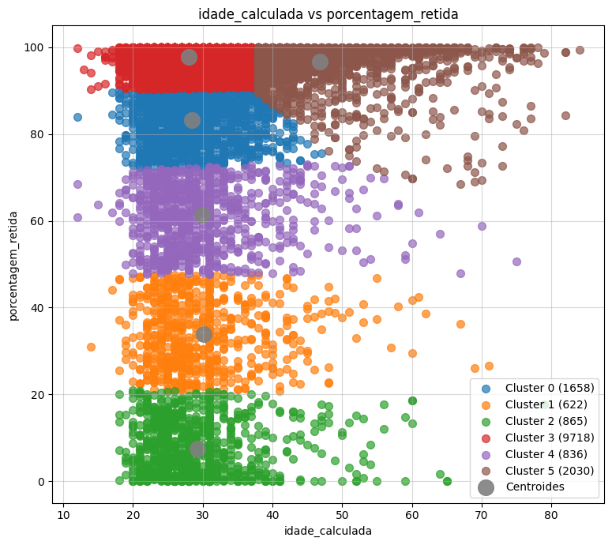
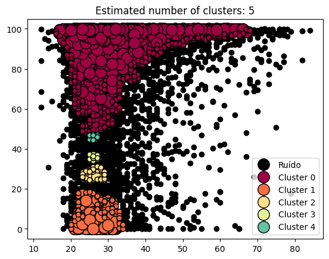

# Projeto de Disciplina de Algoritmos de Inteligência Artificial para Clusterização

Projeto de disciplina de clusterização, utilizando modelos de aprendizado não supervisionado.

## Índice

- <a href='#tecnologias'>1. Tecnologias</a>
- <a href='#contexto'>2. Contexto</a>
- <a href='#análises'>3. Análises</a>
- <a href='#sobre-mim'>4. Sobre mim</a> 

## Tecnologias

 Jupyter Notebook v. 5.7.2

 Python v. 3.11.11

 Anaconda v. 23.7.4 (ambiente virtual chamado '⚙️ venv_clusterizacao2')

## Contexto

O arquivo possui as seguintes colunas:

- _id_transacao_ (TransactionID): Id da transferência feita
- _id_cliente_ (CustomerID): Id do cliente
- _idade_calculada_ (CustomerDOB): Idade do cliente no período da transferência
- _genero_ (CustGender): Gênero sexual do cliente
- _localizazao_ (CustLocation): Localização do cliente
- _saldo_ (CustAccountBalance): Saldo da conta do cliente após a transferência
- _data_transacao_ (TransactionDate): Data da transferência
- _hora_transacao_ (TransactionTime): Hora da transferência em timestamp Unix (o número de segundos que se passaram desde a data da coluna anterior)
- _quantia_transacao (INR)_ (TransactionAmount (INR)): Valor da transferência em rúpias indianas (INR)

## Análises

O projeto realiza análises gráficas de clusterização do arquivo '🏦 bank-transactions.csv' que possui informações de transações bancárias realizadas entre seus clientes.

Para isso, o projeto faz uma análise exploratória da faixa de distribuição dos dados com boxplot, para verificar se há ou não a presença de outliers.

    

Além disso, o projeto implementa os modelos de K-Means, e DBSCAN, onde, basicamente:

- **K-Means**: um modelo de agrupamento (clusterização) de dados numéricos com o objetivo de agrupar dados próximos e encontrar o centro de cada grupo (centroide) até a sua convergência (ponto em que o agrupamento dos dados e o deslocamento dos centroides se torna mínimo ou nulo). Para isso, ele utiliza o hiperparâmetro do número de clusters;

- **DBSCAN**: este modelo classifica os dados nos grupos principais e isola os possíveis outliers (dados cujos valores estão muito equidistantes da maioria). Para isso, ele utiliza dois hiperparâmetros: o "eps" (o tamanho do raio de busca) e o "MinPts" (o número mínimo de pontos necessários que o raio de busca daquele dado precisa encontrar). Este modelo é muito usado para dados mais densos.

O algoritmo imprime gráficos de dispersão para o K-Means:

    

E para o DBSCAN:

    

Para isso, o algoritmo realiza diversas buscas sobre o score da silhueta de cada um dos modelos encontrados.

No final, o algortimo ainda realiza uma checagem de similaridade entre os modelos de modo a demonstrar a diferença entre as metricas e otimizações dde cada modelo.

### Análise do KMeans

Da análise, pode-se depreender que o K-Means clusterizou os clientes da seguinte forma:

- Cluster 0: em sua maioria, homens de 22 a 31 anos de MUMBAI e BANGALORE, que retem cerca de 72% a 90% de seu saldo;

- Cluster 1: em sua maioria, homens de 22 a 33 anos de NEW DELHI e MUMBAI, que retem cerca de 20% a 47% de seu saldo;

- Cluster 2: em sua maioria, homens de 21 a 31 anos de MUMBAI e BANGALORE, que retem cerca de 0% a 20% de seu saldo;

- Cluster 3: em sua maioria, homens de 22 a 31 anos de MUMBAI e NEW DELHI, que retem cerca de 90% a 100% de seu saldo;

- Cluster 4: em sua maioria, homens de 22 a 31 anos de MUMBAI  e BANGALORE, que retem cerca de 47% a 73% de seu saldo;

- Cluster 5: em sua maioria, homens de 38 a 48 anos de MUMBAI e BANGALORE, que retem cerca de 68% a 100% de seu saldo;

Os clientes do _Cluster 0_, _Cluster 3_ e parte dos clientes do _Cluster 4_ e _Cluster 5_ possuem, em geral um ótimo perfil para oferecimento de produtos de investimento e linhas de crédito, pois retem boa parte de seu saldos bancários e suas contas (em torno de 68% a 100%), não oferecendo risco de inadimplência, por exemplo;

Os clientes do _Cluster 2_ e parte do _Cluster 1_ não são tão indicados para esses produtos, possuindo muito mais capital de giro do que retendo patrimônio (entre 0% e 20%), oferencendo um alto risco de inadimplência.

E ainda que não faça parte da moda, observou-se que os clientes mais velhos (de 60 a 85 anos) possuem uma maior retenção de seu saldo (entre 80% e 100%), como evidenciado no _Cluster 5_.

### Análise do DBSCAN

O DBSCAN, por sua vez, agrupou os dados da seguinte forma:

- Cluster 0: em sua maioria, homens de 22 a 31 anos de MUMBAI e NEW DELHI, que retem cerca de 48% a 100% de seu saldo;

- Cluster 1: em sua maioria, homens de 22 a 31 anos de MUMBAI e BANGALORE, que retem cerca de 0% a 18% de seu saldo;

- Cluster 2: em sua maioria, homens de 23 a 29 anos de NEW DELHI e DELHI, que retem cerca de 24% a 31% de seu saldo;

- Cluster 3: em sua maioria, homens de 25 a 27 anos de NEW DELHI e BANGALORE, que retem cerca de 34% a 37% de seu saldo;

- Cluster 4: em sua maioria, homens de 25 a 27 anos de NEW DEHLI e DEHLI, que retem cerca de 44% a 47% de seu saldo;

Segundo o DBSCAN, os clientes do _Cluster 1_ e do _Cluster 2_ são clientes que possuem um alto capital de giro e não retem quase nada de seu patrimônio.

Já os clientes do _Cluster 0_ são clientes que retem muito mais patrimônio, sendo mais indicados para oferecer produtos de investimento e também confirmando o perfil traçado pelo KMeans.

## Sobre mim

    
    

        
Mateus Teixeira

        Pós-graduando em Inteligência Artifcial pela INFNET
         
         
        
        
        
    

